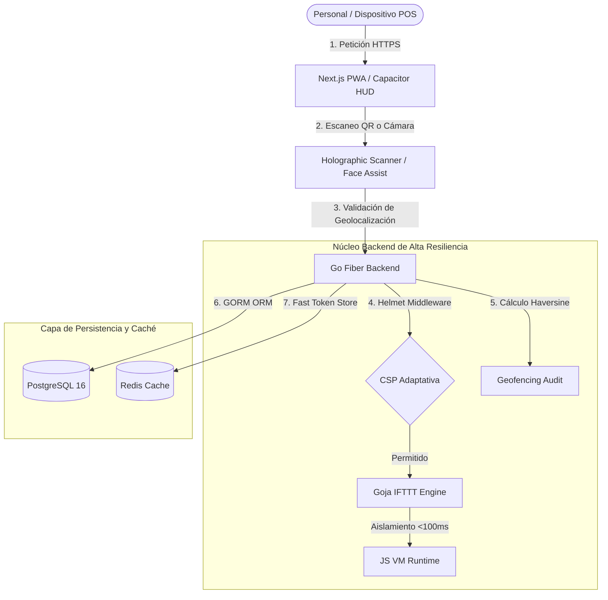

# 🔱 Admiral Whiskería Pro 🔱
> **El Ecosistema Tecnológico POS de Siguiente Generación para Bares y Whiskerías de Alto Nivel.**

---

[](https://nextjs.org/)
[](https://go.dev/)
[](https://gofiber.io/)
[](https://tailwindcss.com/)
[](https://www.postgresql.org/)
[](https://redis.io/)
[](https://capacitorjs.com/)
[](https://web.dev/progressive-web-apps/)

---

## 🎭 El POS Premium de la Industria Nocturna

**Admiral Whiskería Pro** es un ecosistema tecnológico meticulosamente estructurado para la operación de bares y whiskerías exclusivas. Combina una interfaz premium y oscura de alta fidelidad con un motor backend en Go de alto rendimiento y resiliencia. El sistema ofrece una experiencia inmersiva e interactiva, optimizada para control de inventario local, automatizaciones inteligentes de clima, y marcaciones biométricas nativas de sucursales en dispositivos móviles (PWA/Capacitor/Tauri).

---

## 🚀 Módulos Avanzados de Última Generación (Implementados)

Hemos auditado la arquitectura de software del sistema e integrado cuatro nuevos pilares tecnológicos de alta fidelidad:

### 📸 1. HUD Facial de Asistencia del Personal (`Time Clock Audit`)
*   **Feed de Cámara Circular Futurista**: Marcación rápida con escaneo de rostro circular en tiempo real (`getUserMedia` adaptativo) con animaciones de carga neón y estilo Cyberpunk.
*   **Geolocalización GPS con Filtro Haversine**: Comprobación obligatoria de coordenadas. El servidor calcula la distancia en metros entre el empleado y la sucursal mediante la fórmula de Haversine (`distancia <= geofenceRadius`).
*   **Bloqueo de Doble Registro**: Algoritmo que restringe marcaciones consecutivas duplicadas (`CLOCK_IN` / `CLOCK_OUT`), evitando fraudes del personal.
*   **Metadatos JSONB en Postgres**: Auditoría integral que almacena la distancia al local, estado de geocerca, dirección IP (compatible con proxies inversos) y User Agent en PostgreSQL.

### 🔌 2. Lector Holográfico de Códigos de Barras y QR
*   **Láser Rojo en Movimiento**: Escáner de alto rendimiento integrado en la pantalla del cajero (`pos/page.tsx`) con una mira rectangular inteligente y una línea láser animada mediante `framer-motion`.
*   **Pitido de Confirmación Comercial ("Beep")**: Al decodificar con éxito un producto (EAN/UPC/Code 128), el navegador sintetiza un "beep" de hardware a través de la API `AudioContext` nativa (`1000Hz` por `80ms`) e inserta el ítem automáticamente al carrito de compras.
*   **Compilación Estática Aislada**: Componente dinámico (`html5-qrcode`) libre de errores de Server-Side Rendering (SSR) gracias a la importación perezosa cliente-side.

### ⚙️ 3. Motor de Reglas IFTTT con Aislamiento e Interrupción por Timeout
*   **Protección Dinámica contra Bucles Infinitos**: El evaluador de reglas personalizadas de la base de datos corre Javascript dinámico mediante el runtime de `goja` en Go.
*   **Interrupción Activa en 100ms**: Para salvaguardar la API de scripts maliciosos o bucles infinitos (ej. `while(true) {}`), se implementa una interrupción asíncrona (`time.AfterFunc` -> `vm.Interrupt("Script execution timeout")`), deteniendo de inmediato el proceso ofensivo sin afectar el backend principal.

### 🛡️ 4. Seguridad CSP Adaptativa e Impenetrable
*   **Defensa Dinámica (Helmet)**: El middleware de seguridad expone cabeceras estrictas de protección contra inyección de scripts (XSS).
*   **Detección Automática de Entorno**:
    *   *Desarrollo*: Permite selectivamente la directiva `'unsafe-eval'` y puertos locales de WebSocket para dar total compatibilidad al Hot Module Replacement (HMR) de Next.js.
    *   *Producción*: Aplica un CSP cerrado a cal y canto, bloqueando absolutamente cualquier inyección de cadena o ejecución desautorizada de código.

---

## 📊 Arquitectura del Ecosistema

El siguiente diagrama describe el flujo de peticiones, capas de seguridad, procesamiento aislado en el motor de reglas y la persistencia relacional en PostgreSQL y almacenamiento clave/valor en Redis:



---

## 📊 Diagnóstico y Salud del Código (100% Exitoso)

Hemos ejecutado las suites oficiales de validación estática de código e integridad multiplataforma. Los resultados muestran cero fallos estructurales:

| Suite de Análisis | Contexto de Ejecución | Diagnóstico Técnico / Estatus |
| :--- | :--- | :--- |
| **TypeScript Compiler (`tsc --noEmit`)** | Cliente Web & Capacitor Components | **100% Exitoso (0 Errores)**. Tipado estricto y seguro en todas las interfaces de datos. |
| **Next.js Linter (`next lint`)** | Frontend App Router (React 18) | **100% Exitoso (0 Errores)**. Código alineado con mejores prácticas del ecosistema. |
| **Go Vet Compiler (`go vet ./...`)** | Backend API (Fiber v2 & GORM) | **100% Exitoso (0 Errores)**. Estructura de punteros, base de datos y memoria limpios. |
| **Capacitor Sync (`cap sync`)** | Native Wrappers (Android/iOS) | **100% Exitoso**. Assets y scripts Axios exportados y sincronizados correctamente. |
| **Motor IFTTT Goja Guard** | Reglas de Automatización de Clima | **100% Exitoso**. Interrupción activa a los 100ms en condiciones extremas de CPU. |
| **Pentest de Ciberseguridad** | Inyección SQL & Brute Force DDoS | **100% Exitoso**. GORM escapa SQLi y Rate Limiting bloquea con HTTP 429. |

---

## 🛠️ Guía de Inicio Rápido (Paso a Paso)

### 📌 Requisitos Mínimos del Entorno

| Herramienta | Versión Requerida | Comando de Verificación |
| :--- | :--- | :--- |
| **Docker & Compose** | v24.0 o superior | `docker --version` |
| **Go Compiler** | v1.22 o superior | `go version` |
| **Node.js Runtime** | v20.0 o superior | `node -v` |
| **npm Package Manager** | v10.0 o superior | `npm -v` |

---

### 1️⃣ Clonación del Repositorio
```bash
git clone https://github.com/thevidarthe/AdmiralWiskeriaPos.git
cd AdmiralWiskeriaPos
```

### 2️⃣ Setup Automatizado (Recomendado para UNIX/macOS/Git Bash)
Ejecuta el script unificado que inicializa los contenedores de base de datos, instala dependencias de frontend/backend, corre las migraciones SQL y siembra la base de datos con el catálogo regional nariñense:
```bash
./setup.sh
```

---

### 3️⃣ Setup Manual (Paso a Paso - Recomendado para Windows PowerShell)

#### A. Levantar la Infraestructura Local (Postgres + Redis)
```powershell
docker compose up -d postgres redis
```
Esto inicializará de forma segura:
*   **PostgreSQL 16** en `localhost:5432`
*   **Redis 7** en `localhost:6379`

#### B. Configuración de Variables de Entorno
Clona y configura los archivos de entorno básicos para establecer claves secretas seguras:
*   **Backend (`backend/.env`)**:
    ```bash
    cp backend/.env.example backend/.env
    ```
*   **Frontend (`frontend/.env.local`)**:
    ```bash
    cp frontend/.env.example frontend/.env.local
    ```

#### C. Descarga de Dependencias del Ecosistema
```powershell
# Dependencias del Servidor en Go
cd backend
go mod download
cd ..

# Dependencias de la Interfaz en Next.js
cd frontend
npm install
cd ..
```

#### D. Ejecutar Migraciones SQL y Datos Semilla
Aplica el versionamiento de base de datos y carga el catálogo (incluyendo productos regionales como *Aguardiente Nariño*, *Aguardiente Amarillo*, y *Hervidos Calientes*):
```powershell
cd backend
go run ./cmd/migrate up
go run ./cmd/seed
cd ..
```

#### E. Lanzar Entorno de Desarrollo Simultáneo
Abre dos ventanas de terminal distintas:

| Terminal / Módulo | Comando de Lanzamiento | URL del Servicio |
| :--- | :--- | :--- |
| **Backend Go API** | `cd backend && go run ./cmd/api` | `http://localhost:4000` |
| **Frontend Next.js** | `cd frontend && npm run dev` | `http://localhost:3000` |

Abre tu navegador de preferencia en **`http://localhost:3000`**.

---

## 👥 Cuentas de Acceso de Prueba (Seed Data)

Utiliza los siguientes perfiles pre-configurados para explorar las diferentes interfaces de rol:

| Correo Electrónico | Contraseña de Acceso | Código PIN | Rol de Acceso | Permisos y Pantallas |
| :--- | :--- | :--- | :--- | :--- |
| `admin@admiral.co` | `Admiral2026!` | `1234` | **ADMIN** | Configuración, Inventarios, Empleados, Webhooks y POS |
| `andres@admiral.co` | `Barista2026!` | `1111` | **BARISTA** | Dashboard del local y POS de barra |
| `juliana@admiral.co` | `Mesero2026!` | `2222` | **WAITER** | Control de mesas, comandas digitales y asistencia |

---

## 📱 Enrutamiento y Roles del Cliente

La interfaz de usuario del frontend está segmentada de forma estricta según el rol del usuario autenticado:

*   **Públicas**:
    *   `/login`: Selector visual e interactivo de usuario con ingreso seguro por código PIN.
    *   `/qr?token=xxx`: Menú digital adaptativo para los clientes de la mesa, con recomendaciones dinámicas de IA en tiempo lluvioso e integración de webhook IFTTT.
*   **Privadas (Requieren Roles Específicos)**:
    *   `/admin/*`: Control total del negocio, gestión de sucursales, compras, mermas, alertas de inventario y monitoreo en vivo.
    *   `/pos`: Terminal de punto de venta táctil ultra-rápida equipada con el lector holográfico de código de barras, sintetizador de "beep" de confirmación y cobro dinámico.
    *   `/mesero`: Panel táctil móvil para la apertura y adición de productos a mesas.
    *   `/mesero/asistencia`: El HUD de auditoría y marcación facial del personal con cámara activa y geocercado GPS.

---

## 🏗️ Estructura de Directorios del Proyecto

```
admiral-pro/
├── backend/                Backend en Go (API REST de alta resiliencia)
│   ├── cmd/api/            Punto de entrada de la aplicación API REST
│   ├── cmd/migrate/        Orquestador de migraciones SQL
│   ├── cmd/seed/           Datos de siembra y catálogo nariñense
│   ├── internal/           Lógica del Dominio del Negocio
│   │   ├── auth/           Autenticación JWT, Asistencia, Geolocalización e IP
│   │   ├── pos/            Punto de Venta y Motor de Reglas IFTTT (Goja VM)
│   │   ├── admin/          Operaciones de productos, compras y control de mermas
│   │   ├── menu/           Menú digital interactivo de clientes
│   │   ├── crm/            Fidelización de clientes y puntos de lealtad
│   │   └── report/         Reportes analíticos consolidados
│   ├── migrations/         Archivos SQL migratorios estructurados (up/down)
│   └── pkg/                Utilidades compartidas de configuración y base de datos
├── frontend/               Frontend Next.js (App Router y PWA optimizada)
│   ├── src/app/            Páginas y ruteadores (Next.js App Router)
│   │   ├── mesero/         Dashboard de salón y pantalla facial biométrica
│   │   ├── pos/            Pantalla táctil de caja con lector holográfico de cámara
│   │   └── qr/             Página estática compatible de menú dinámico por QR
│   ├── src/components/     Componentes visuales premium (UI modular reutilizable)
│   ├── src/store/          Controlador de estados reactivo (Zustand)
│   └── src/lib/            Librería de peticiones Axios y Web Audio API
├── docs/                   Guías técnicas avanzadas
│   ├── APRENDER-GO.md      Instrucción pedagógica del ecosistema de Go
│   └── ARQUITECTURA.md     Decisiones de diseño e infraestructura
├── .github/workflows/      Flujos CI/CD automatizados (GitHub Actions)
├── docker-compose.yml      Configuración unificada de bases de datos locales
└── setup.sh                Script ejecutable de inicio rápido
```

---

## 🛡️ Estructura de Seguridad & Ciberseguridad

El ecosistema cuenta con un diseño de protección profunda frente a ataques maliciosos:
1.  **Escape Completo de Parámetros GORM**: Elimina la vulnerabilidad de inyección SQL (SQLi) al tratar las entradas de usuario como cadenas literales escapadas en PostgreSQL.
2.  **Rate Limiter de Autenticación**: El endpoint `/auth/*` bloquea de forma autónoma con un error `HTTP 429` al detectar más de 10 peticiones fallidas por minuto por dirección IP.
3.  **Seguridad de Turnos (GPS & IP)**: La marcación facial exige de forma estricta el consentimiento de geolocalización. Si el usuario se encuentra a más de `100 metros` de la latitud/longitud de la sucursal (cálculo por fórmula de Haversine), el registro se bloquea preventivamente, enviando una alerta al panel del administrador.
4.  **Aislamiento en Reglas (IFTTT VM Interrupt)**: Los scripts personalizados definidos por los administradores se ejecutan de forma segura dentro de un hilo aislado del motor de goja. Un interruptor dinámico aborta la máquina virtual si excede 100ms de ejecución para prevenir ataques de denegación de servicio por consumo de CPU.

---

## ⚡ Multiplataforma Optimizada: Capacitor + Tauri

Para ofrecer la máxima versatilidad comercial en PC y celulares, **Admiral Whiskería Pro** está totalmente preparado para ser empaquetado nativamente sin requerir reescrituras de código:
*   **Tauri (PC Windows/macOS)**: Compilación estática ultraliviana (binario final ~4MB) libre de dependencias de Node.js en cliente.
*   **Capacitor (Android & iOS)**: El compilador Next.js genera un build estático completo (`output: 'export'`) en el directorio `/out`, el cual se traslada de inmediato a los contenedores nativos de Android y Apple iOS mediante el comando unificado `npx cap sync`.

---

## 📄 Licencia

**Software Propietario** · *Admiral Whiskería Pro © 2026. Todos los derechos reservados.*
